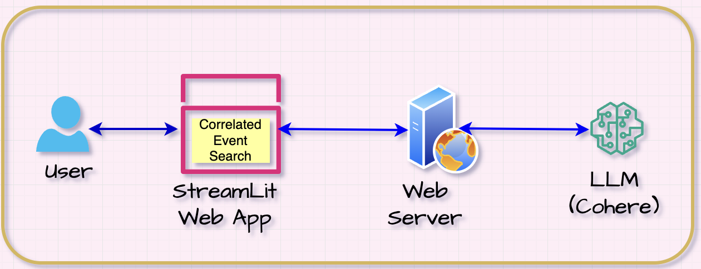

# sus-lc-ai-app-1

# <u>AI App 1 - "Correlated Event Search" LLM App using LangChain</u>

**Tools & Technologies Used:**

- Python

- LangChain Framework

- LLM – Cohere

- StreamLit

- Integration (Django, HTML, CSS)

**Solution Architecture Diagram:**

