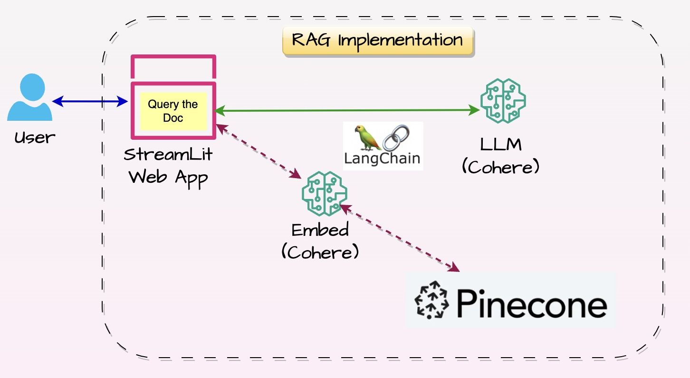

# sus-ai-app-doccomp

# <u>"Document Companion" LLM Powered AI App</u>

**Tools & Technologies Used:**

- Python

- LangChain Framework

- LLM – Cohere

- Vector DB - PineCone

- StreamLit

**Solution Architecture Diagram:**

